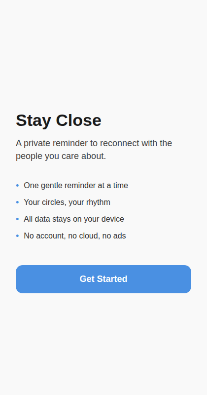
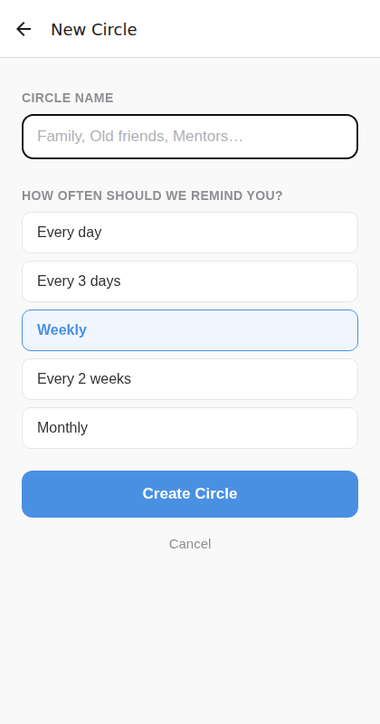
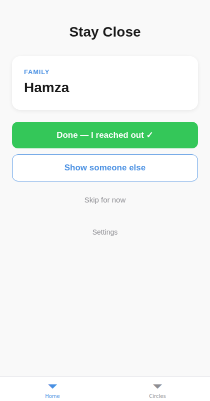
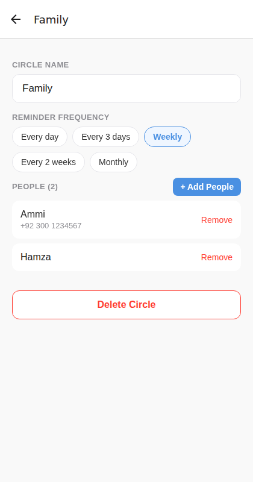

<div align="center">

# 🤝 Stay Close

**A private, local-first relationship reminder app.**  
No cloud. No account. No tracking. Your contacts never leave your device.

[](https://github.com/abubakarshahid16/stay-close/actions/workflows/ci.yml)
[](https://github.com/abubakarshahid16/stay-close/releases/latest)
[](LICENSE)
[](#install)
[](#privacy)

[**📱 Download APK**](https://github.com/abubakarshahid16/stay-close/releases/latest) · [**🌐 Open Web App**](https://abubakarshahid16.github.io/stay-close) · [Report a Bug](https://github.com/abubakarshahid16/stay-close/issues/new?template=bug_report.yml) · [Request a Feature](https://github.com/abubakarshahid16/stay-close/issues/new?template=feature_request.yml)

</div>

---

## The Problem

You have people in your life who matter — family, old friends, mentors, colleagues — and life gets busy. Weeks pass. Months pass. You mean to reach out, but you forget. By the time you think of someone, it feels awkward.

**Stay Close fixes that.** It gently reminds you who to reach out to next, one person at a time.

## ✨ Features

- **Smart reminders** — A weighted algorithm picks who you've neglected the longest, with a little randomness so it doesn't feel mechanical
- **Circles** — Group your contacts (Family, Friends, Work, etc.) each with their own reminder cadence: daily, every 3 days, weekly, every 2 weeks, or monthly
- **Three actions** — "Done — I reached out ✓", "Show someone else", or "Skip for now"
- **Contact picker** — Search and add directly from your phone contacts
- **Privacy-first notifications** — Optional local push notifications that show "Time to reach out" without naming the person
- **Backup & restore** — Export your data as a JSON file; import it anytime
- **Zero internet** — No network calls, ever. Nothing leaves your phone.

## 📸 Screenshots

| Onboarding | Create a Circle |
|---|---|
|  |  |

| Today's Suggestion | Manage a Circle |
|---|---|
|  |  |

## 📱 Install

### Android (recommended)

1. Go to the [**latest release**](https://github.com/abubakarshahid16/stay-close/releases/latest)
2. Download `stay-close-vX.X.X.apk`
3. Open the file on your phone
4. If prompted, allow **Install unknown apps** for your browser in Settings
5. Tap **Install**

> Android only needs this permission once. Stay Close itself has no internet permission.

### Web (any browser)

Open **[abubakarshahid16.github.io/stay-close](https://abubakarshahid16.github.io/stay-close)** on your laptop or phone browser.

> The web version runs fully in-browser. Note: contacts access and push notifications are limited by browser APIs.

## 🔒 Privacy

Stay Close was designed from the ground up with privacy as a hard constraint, not an afterthought.

| What we do | What we don't do |
|---|---|
| Store everything in SQLite on your device | No server, no API, no backend |
| Use contact names/numbers you pick | Never upload contacts anywhere |
| Send local notifications | No push notification service |
| Let you export your data as plain JSON | No analytics, no crash reporting |
| Run 100% offline | No internet permission in the manifest |

Your data is yours. Uninstall the app and it's gone — no account to delete, no data to request.

## 🏗️ Tech Stack

| Layer | Technology |
|---|---|
| Framework | React Native + Expo SDK 57 |
| Navigation | Expo Router (file-based) |
| Database | expo-sqlite (SQLite, local only) |
| Contacts | expo-contacts |
| Notifications | expo-notifications (local only) |
| Backup | expo-file-system + expo-sharing |
| Testing | Jest + React Native Testing Library |
| CI/CD | GitHub Actions |

## 🧪 Testing

```bash
npm install
npm test
```

136 tests across six layers: unit → database → components → integration → end-to-end → manual QA.

```
PASS  __tests__/unit/ReminderEngine.test.ts
PASS  __tests__/unit/prng.test.ts
PASS  __tests__/unit/validation.test.ts
PASS  __tests__/db/CircleRepository.test.ts
PASS  __tests__/db/CirclePeopleRepository.test.ts
PASS  __tests__/db/ReminderHistoryRepository.test.ts
PASS  __tests__/db/SettingsRepository.test.ts
PASS  __tests__/components/CirclesScreen.test.tsx
PASS  __tests__/components/CreateCircleScreen.test.tsx
PASS  __tests__/components/CircleDetailScreen.test.tsx
PASS  __tests__/components/AddPeopleScreen.test.tsx
PASS  __tests__/components/SettingsScreen.test.tsx
PASS  __tests__/integration/BackupService.test.ts
```

## 🚀 Development

```bash
# Install dependencies
npm install

# Start development server
npx expo start

# Scan QR code with Expo Go on your phone
```

### Run on device

```bash
# Android
npx expo run:android

# iOS (macOS only)
npx expo run:ios
```

### Build release APK

Tag a release and GitHub Actions builds it automatically:

```bash
git tag v1.0.0
git push origin v1.0.0
# APK appears at /releases in ~15 minutes
```

### Deploy the web app

Every push to `main` builds the web export and publishes it to GitHub Pages
(`.github/workflows/deploy-web.yml`). The workflow enables Pages automatically
on first run; if it fails with a permissions error, set **Settings → Pages →
Source: GitHub Actions** once and re-run.

The web build is configured for project-page hosting via
`experiments.baseUrl: "/stay-close"` in `app.json` — if you fork this repo
under a different name, change that value to match.

Web limitations (by design, the phone app is the primary target): the device
contact picker and scheduled notifications aren't available in browsers, so
the web app uses manual person entry and skips notification scheduling.
Data persists in browser storage via SQLite (WASM).

## 📁 Project Structure

```
stay-close/
├── app/                        # Expo Router screens
│   ├── _layout.tsx             # Root layout (DatabaseProvider)
│   ├── (tabs)/                 # Tab navigation
│   │   ├── index.tsx           # Home — today's suggestion
│   │   └── circles.tsx         # Circles list
│   ├── circles/
│   │   ├── create.tsx          # Create circle modal
│   │   ├── [id].tsx            # Circle detail + people
│   │   └── [id]/select.tsx     # Contact picker
│   ├── settings/index.tsx      # Settings screen
│   └── onboarding/index.tsx    # First-run onboarding
├── src/
│   ├── db/
│   │   ├── database.ts         # Migration runner
│   │   └── repositories/       # CircleRepo, PeopleRepo, HistoryRepo, SettingsRepo
│   ├── services/
│   │   ├── ReminderEngine.ts   # Weighted selection algorithm
│   │   ├── ContactService.ts   # expo-contacts wrapper
│   │   ├── NotificationService.ts
│   │   └── BackupService.ts    # Export / import JSON
│   ├── context/DatabaseContext.tsx
│   ├── hooks/                  # useCircles, useSettings
│   ├── components/             # LoadingView, ErrorView, etc.
│   ├── types/                  # TypeScript interfaces
│   └── utils/validation.ts
├── __tests__/                  # All test suites
├── .github/workflows/
│   ├── ci.yml                  # Tests on every push
│   ├── build-android.yml       # APK + GitHub Release on tag
│   └── deploy-web.yml          # GitHub Pages on main push
└── eas.json                    # Build profiles
```

## 🤝 Contributing

Contributions are welcome! Please read [CONTRIBUTING.md](CONTRIBUTING.md) first.

- 🐛 [Report a bug](https://github.com/abubakarshahid16/stay-close/issues/new?template=bug_report.yml)
- 💡 [Request a feature](https://github.com/abubakarshahid16/stay-close/issues/new?template=feature_request.yml)
- 📖 Improve documentation

## 📄 License

MIT © [abubakarshahid16](https://github.com/abubakarshahid16) — see [LICENSE](LICENSE) for details.

---

<div align="center">
Made with ❤️ for people who care about staying connected.
</div>
